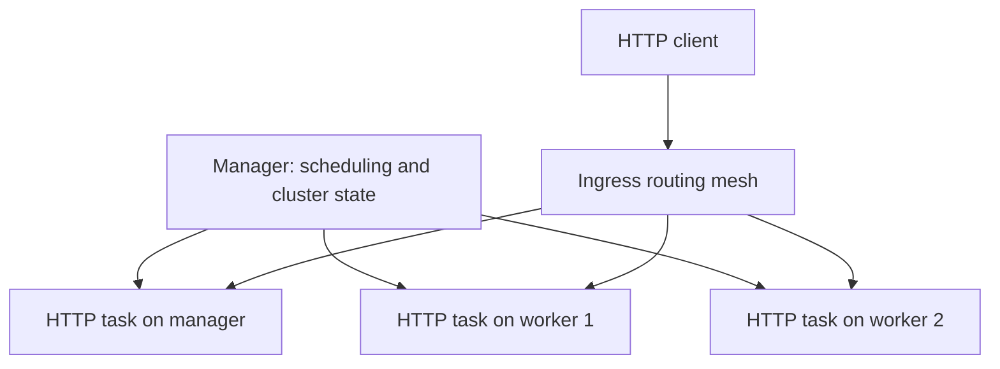

# Docker Swarm Lab

**Three-node container orchestration lab: service replication, task placement, and recovery after container removal.**

By [Rachid EL MAGROUA](https://github.com/rachidelmagrouaIng)

[Français](README.fr.md) · [Lab walkthrough](docs/lab-guide.md) · [Original evidence](docs/evidence.md) · [Security notes](docs/security.md)

## Project overview

This project documents my Docker Swarm presentation and practical lab. The original screenshots show one manager and two workers, an Apache HTTP service running with three replicas, and a replacement container after a task container was removed.

The repository adds a declarative stack and repeatable exercises so readers can reproduce the core concepts. These files were prepared after the presentation; they are not the original lab source code. The new stack has not yet been executed on a live cluster.

## What the project demonstrates

| Area | Evidence or implementation |
| --- | --- |
| Linux and cluster administration | Original three-node cluster, all nodes Ready and Active |
| Container orchestration | Original HTTP service with 3/3 replicas |
| Distributed task placement | Original service tasks placed across all three nodes |
| Desired-state recovery | Original before/after screenshot of forced container removal |
| Infrastructure configuration | New `stack.yml` with replicas, resource limits, and update policy |
| Technical communication | French presentation summarized in English and French documentation |


## Architecture



The diagram illustrates the observed task distribution. Placement can change during scheduling and recovery. One manager is sufficient for this learning lab but provides no manager fault tolerance. This project does not claim measured uptime or production readiness.

## Quick start

Use dedicated Linux lab hosts with Docker Engine installed and mutually reachable private addresses. Run cluster-management commands on the manager. Start with [network prerequisites](docs/lab-guide.md#1-network-prerequisites).

```bash
# On the manager: substitute its private interface address.
docker swarm init --advertise-addr <MANAGER_PRIVATE_IP>
docker swarm join-token worker
```

Run the generated join command privately on each worker. Do not commit its token.

```bash
# Back on the manager, from this repository:
docker node ls
docker stack deploy -c stack.yml swarm-lab
docker stack services swarm-lab
docker service ps swarm-lab_web
curl --fail http://<NODE_PRIVATE_IP>:8080/
```

Wait for `3/3` running replicas before testing. The demo serves the default Apache page. `httpd:2.4-alpine` is a mutable release-family tag; record or pin the resolved digest for a repeatable run. Every node needs access to the image registry.

Follow the [walkthrough](docs/lab-guide.md) for scaling, container replacement, worker maintenance, updates, rollback, and cleanup.

## Repository contents

| Path | Purpose |
| --- | --- |
| `stack.yml` | New Swarm deployment for a replicated HTTP service |
| `examples/hello-python/` | Small Docker build exercise reconstructed from the slides |
| `docs/evidence.md` | Selected original screenshots and limits of each observation |
| `docs/lab-guide.md` | Commands, expected observations, and troubleshooting |
| `docs/security.md` | Network exposure, join-token handling, and production gaps |
| `docs/results-template.md` | Worksheet for recording new runs without inventing results |
| `scripts/validate.sh` | Docker stack parsing and Python example checks |
| `.github/workflows/validate.yml` | Configuration validation on pushes and pull requests |

## Technical clarifications

- Maintaining a configured replica count is desired-state reconciliation. Load-based autoscaling requires additional tooling.
- Swarm orchestrates containers; it does not itself supply an entire CI/CD pipeline.
- Manager quorum and application replication solve different availability problems. Three replicas do not protect a single manager's control plane.
- A container includes user-space files and dependencies and shares its host kernel.

## Validation status and next work

The original screenshots provide historical evidence. The new files have received static review and the Python example runs locally. Docker is unavailable in the preparation environment, so Docker parsing, image execution, and multi-node tests remain pending. The included CI workflow has not yet run on GitHub.

- [ ] Run the new stack on three current Linux hosts and record versions and image digests.
- [ ] Capture new deployment, recovery, and scaling results using the results template.
- [ ] Measure recovery time and request failures during worker interruption.
- [ ] Explore three managers, TLS termination, health checks, and monitoring as separate extensions.

## References

- [Docker: deploy a stack](https://docs.docker.com/engine/swarm/stack-deploy/)
- [Docker: Swarm networking](https://docs.docker.com/engine/swarm/networking/)
- [Docker: administer a Swarm](https://docs.docker.com/engine/swarm/admin_guide/)

