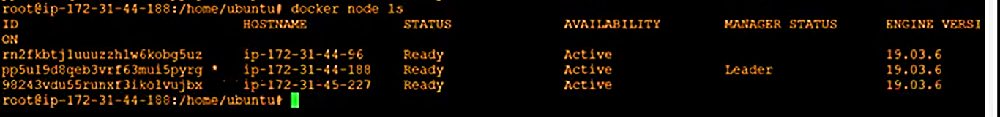
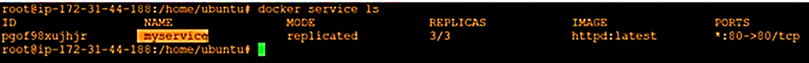
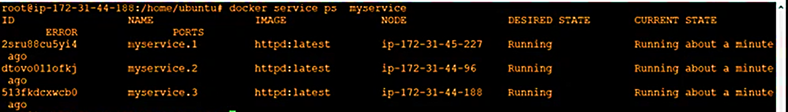
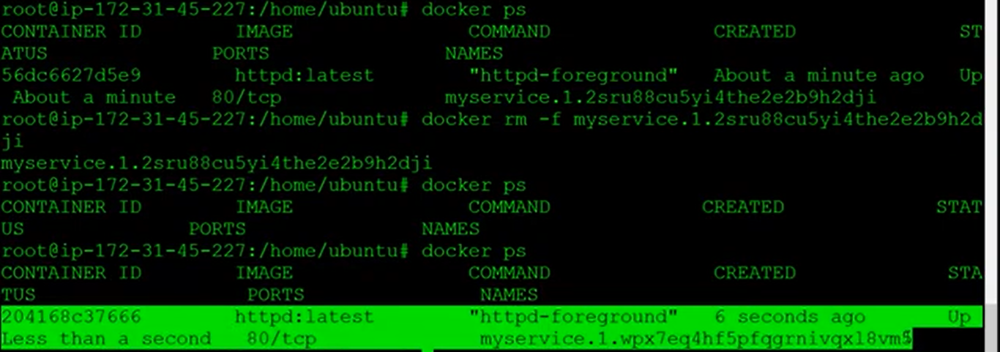

# Lab validation

I built a three-node Docker Swarm cluster to explore service replication, task placement, and recovery after container removal. This page records the results of those exercises.

## Cluster configuration

I configured one manager and two workers, then checked cluster membership with `docker node ls`.

All three nodes appear as **Ready** and **Active**, with the manager elected **Leader**. The manager also participates in running application tasks.

## HTTP service deployment

I deployed an Apache HTTP service named `myservice` with three replicas and checked its state with `docker service ls`.

The service reached **3/3 running replicas**, using `httpd:latest` and publishing port **80**.

## Task distribution

I used `docker service ps myservice` to inspect where the service tasks were running.

At the time of inspection, each node hosted one task. This confirmed that the service was running across the cluster. Task placement can change as node availability and resource capacity change.

## Recovery after container removal

I removed one running service container with `docker rm -f`, then inspected the containers on the node.

A new container appeared with a different ID for the same service task slot. This demonstrates Swarm restoring the configured replica count after a container is removed.

The exercise verifies container replacement. Recovery time and HTTP request failures were not measured.

## Results summary

| Check | Observed result |
| --- | --- |
| Cluster membership | One manager and two workers, all Ready and Active |
| Service replication | Three running replicas |
| Task distribution | One task on each of the three nodes at inspection |
| Container replacement | A new service container appeared after removal |

## Configuration notes

The captured run uses Docker Engine 19.03.6. The repository's deployment configuration differs from that run:

| Setting | Captured lab run | Repository stack |
| --- | --- | --- |
| Service name | `myservice` | `swarm-lab_web` |
| Image | `httpd:latest` | `httpd:2.4-alpine` |
| Published port | 80 | 8080 |
| Replicas | 3 | 3 |

Validation of the repository stack is tracked separately in the [test record](results-template.md).

## Further validation

My next tests cover manual scaling, worker maintenance, rolling updates, and rollback. I also plan to measure recovery time and request failures during an interruption.

The cluster has one manager, so manager fault tolerance is outside the scope of this configuration.
